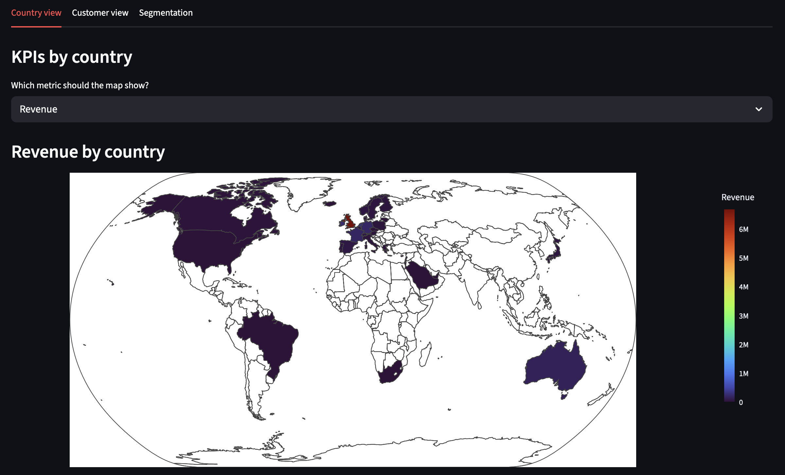
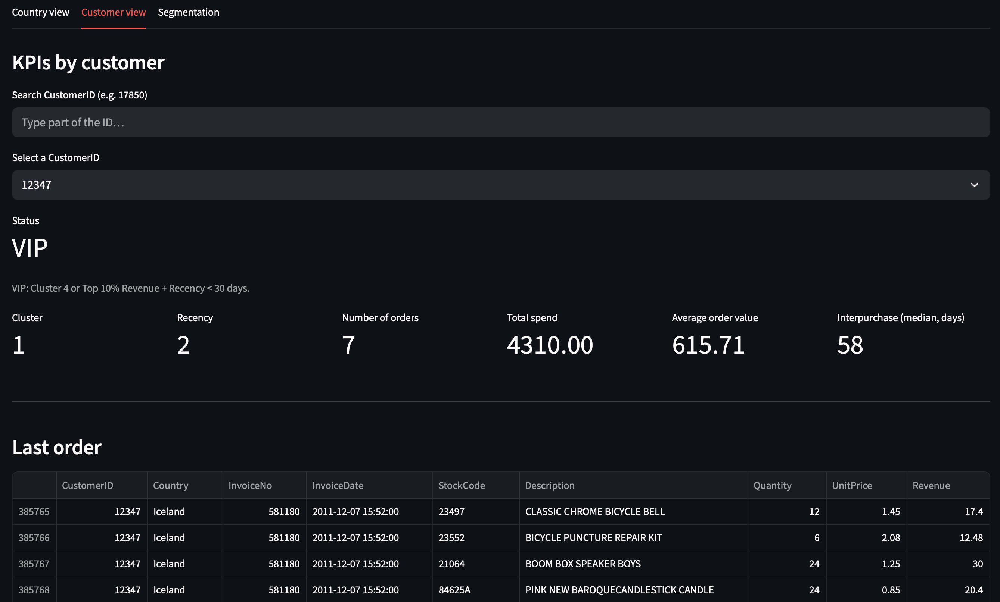
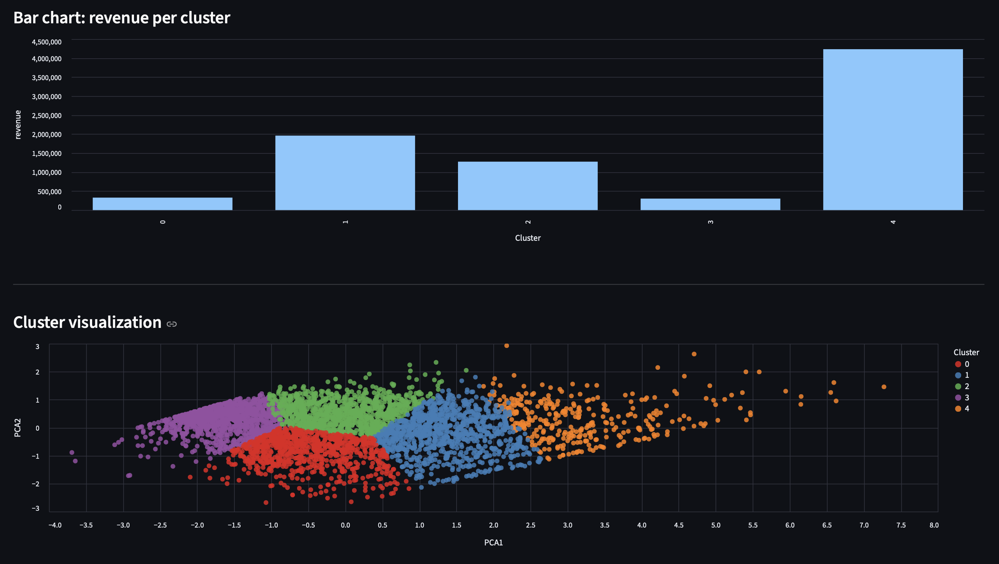

# Customer Segmentation for E-commerce (RFM + Clustering)

Understand your customers, target the right ones, and increase retention & revenue.

## The Problem

Most e-commerce companies treat all customers the same.

→ Marketing campaigns are too broad  
→ High-value customers are under-leveraged  
→ At-risk customers are not identified early  

Result: wasted budget and missed revenue opportunities.

## The Approach

This project segments customers based on their purchasing behavior using:

- Recency (how recently they bought)
- Frequency (how often they buy)
- Monetary (how much they spend)

Customers are then grouped into clear segments using clustering.

Each segment is translated into actionable business insights.

## Results — 5 Customer Segments

| Cluster | Persona | Profile | Actions |
|---------|---------|---------|---------|
| 4 | VIP / Premium | Very recent · very frequent · highest spenders | Reward Loyalty, early access, exclusive offers |
| 1 | Loyal High-Value | Regular buyers · strong revenue | Upsell & cross-sell opportunities |
| 2 | Potential Loyalists | Good spenders · recently inactive | Re-engagement campaigns (email, promos) |
| 0 | Occasional Buyers | Low frequency · low spend | Increase purchase frequency (discount triggers) |
| 3 | At-Risk Customers | Long inactivity · low lifetime value | Win-back campaigns before churn |

## How This Can Be Used in a Company

This type of segmentation can directly support:

- CRM & email marketing targeting  
- Customer retention strategies  
- Budget allocation across campaigns  
- Personalization of offers and messaging  

Example:  
Instead of sending the same campaign to everyone, a company can target only “At-Risk” customers with a reactivation offer — reducing cost and increasing ROI.

## Business Impact

- Increase retention by identifying churn risks early  
- Improve marketing ROI with targeted campaigns  
- Focus efforts on high-value customers  
- Enable data-driven decision making  

## Tech Stack

- Python 
- Pandas
- Scikit-learn
- K-Means
- PCA
- Matplotlib
- Plotly
- Altair
- Streamlit

## Streamlit Application (Interactive Demo)

An interactive dashboard built on top of the segmentation model, organized in three tabs.

Country view — Choropleth map showing revenue, orders, customers, or average basket by country. Includes a Top 10 ranking table and a full sortable data table.  
Customer view — Search and select any customer by ID. Displays their cluster, recency, number of orders, total spend, average order value, and median interpurchase time. VIP and At-risk flags are surfaced automatically based on cluster assignment and behavioral rules. The last order detail is shown below.  
Segmentation — Bar charts comparing number of customers and revenue per cluster, plus an interactive PCA scatter plot to visualize cluster separation.

-   
-   
-   

Run locally:

```bash
python3 -m streamlit run app/main.py
```

## Work With Me

I help companies turn their customer data into actionable insights.

I can help you:
- Segment your customers  
- Identify high-value and at-risk users  
- Build dashboards or simple tools for marketing teams  

Feel free to reach out if you want to apply this to your business.

## Key Visual Insights

### PCA Clustering (2D)


### Radar Charts — Cluster Profiles


### Top 10 Products by Revenue (EDA)


## Extensions

- Real-time customer segmentation  
- Integration with CRM tools  
- Recommendation systems based on segments  
- Advanced clustering methods  
